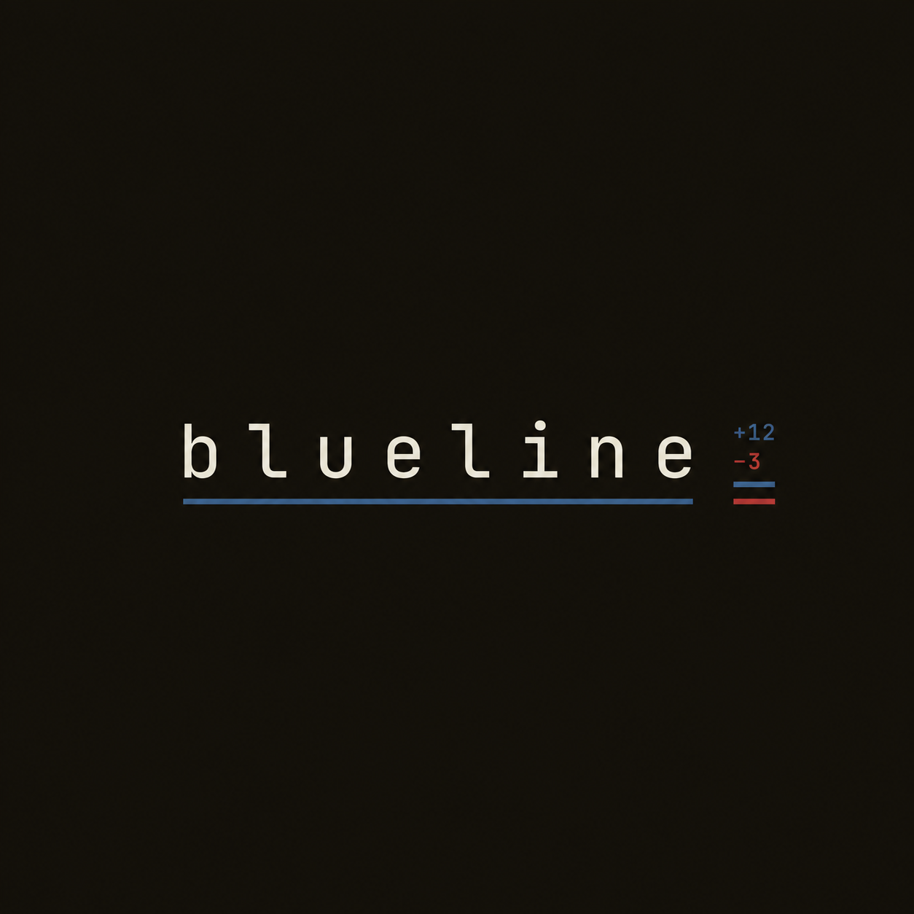

<p align="center"></p>

> Approve the change, not the download.

Blueline is a review step for package installs. It extracts the release tarball in an isolated sandbox, calculates what changed against your last verified version, and prompts for approval before anything touches your machine.

## The problem

Package managers treat installs as a transport problem. You ask for a package, they fetch the tarball, unpack it, and run whatever install scripts came with it. If an attacker pushed malicious code ten minutes ago, your machine executes it before you can look.

- 96% of developers use AI coding tools, but only 18% run security checks continuously (Checkmarx 2026).
- The TanStack router worm shipped malicious npm packages that carried valid SLSA L3 build provenance (Unit42).
- 46% of developers distrust AI output, and 96% do not fully trust its functional accuracy (Stack Overflow 2025).
- 41% of developers rank managing tech debt among their top five daily frustrations (Sonar State of Code 2026).

Autonomous agents install dependencies without reading them. Nobody audits the delta between 4.21.1 and 4.21.2 when an agent runs an install command in a loop.

## The review card

Blueline intercepts package installs and renders a summary card before extracting files to your project:

```bash
$ npx blueline install express@4.21.2

  BLUELINE REVIEW CARD
  ─────────────────────────────────────────
  package:    express
  version:    4.21.2
  previous:   4.21.1 (last known-clean)

  delta:      +3 files, -1 file
  size:       +1.2 KB
  author:     expressjs (verified)
  permissions: no new binaries
  install script: none

  changed:    lib/router/index.js (3 lines)
              lib/router/layer.js (1 line, comment only)
              package.json (version bump)

  verdict:    ▶ LOW RISK

  [a]pprove · [h]old · [d]iff
```

If a release exceeds risk thresholds, Blueline blocks the install and halts the workflow.

## Project status

- [x] Sandboxed tarball extraction with path traversal and symlink guards
- [x] Package manifest parser and integrity verification (SHA-512)
- [x] SQLite store for verified baseline releases
- [x] CLI review command (`blueline review <pkg@ver>`)
- [ ] Line-level diff engine
- [ ] npm and npx wrapper shim
- [ ] GitHub Action PR check
- [ ] Agent hook via Model Context Protocol (MCP)
- [ ] Revocation index and recall API

## Quickstart

Clone the repository and build the release binary:

```bash
git clone https://github.com/Epoch-AI-Lab/blueline.git
cd blueline
cargo build --release
./target/release/blueline review express@4.21.2
```

## Contributors

See [CONTRIBUTORS.md](./CONTRIBUTORS.md) for maintainers, contributors, and details on how to get involved.

## License

The CLI, diff engine, and CI checks are licensed under the MIT License. See [LICENSE](./LICENSE) for details.

